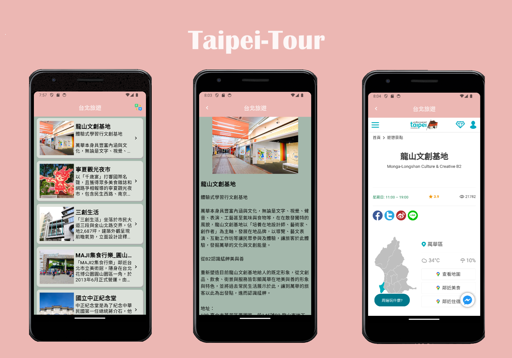

# Taipei-Tour-Compose

## 動機
近幾年 compose 漸漸成為 android 畫面開發的主流，且官方對於該函式庫的支援日趨成熟，目前公司維護的專案部分畫面也有使用到，因此想藉由過去實作過的專案([Taipei-Tour](https://github.com/Leolai80047/Taipei_Tour))畫面以 compose 去編寫，以記錄自己對新技術的掌握程度。

## 概述
這是一個台北旅遊景點介紹的 app ，支援 9 種國家語系，若曾經更新語系紀錄，下次開啟會顯示上次切換到的語系，旅遊列表在頂部時，螢幕下滑可以刷新列表，並以分頁呼叫的方式獲取資料，防止載入時間過久，點擊景點列表物件進入景點詳情，最下方有連結可以進入台北市政府官網介紹頁。

## 使用套件與支援版本
- 最小SDK支援版本 - 21
- 以 [Kotlin](https://kotlinlang.org/) 編寫並使用 [Flow](https://kotlinlang.org/api/kotlinx.coroutines/kotlinx-coroutines-core/kotlinx.coroutines.flow/) + [Coroutine](https://kotlinlang.org/docs/coroutines-overview.html) 實現非同步資料處理
- Jetpack Libraries:
  - Jetpack Compose: Android 使用聲明式編成實現畫面建構
  - ViewModel: MVVM中與 data 層通訊的連接層，主要負責畫面背後的處理邏輯與資料儲存
  - Navigation: 畫面與畫面之間切換的管理套件
  - Hilt: 協助處理 DI 的物件創建，減少元件間的耦合與創建物件的實例規則
  - Splashscreen: 支援開啟 app 的過渡畫面
  - Paging: 提供分頁載入列表物件，減少一次性取得所有資料的開銷
  - Preference: 建置本地端的資料儲存空間，適合輕便資料的存取
- [Retrofit2](https://square.github.io/retrofit/) & [Okhttp3](https://square.github.io/okhttp/): 建立網路連線，與目標伺服器要求指定資料，配合 paging 片段載入資料
- [Glide](https://bumptech.github.io/glide/int/compose.html): 圖片載入的第三方套件，支援圖片裁切、圖片載入顯示邏輯等功能
- Architecture:
  - MVVM(Model-View-ViewModel): 關注點分離，避免程式互相引用造成高耦合，方便維護與後續擴充
  - UseCase pattern: 支援共用的商業邏輯使用，避免多個 ViewModel 使用相同邏輯，以至於修改邏輯需要修改多處
  - Repository pattern: 資料存取的中介層，專注於資料來源的操作

## Open API
Taipei-Tour 使用 [台北旅遊網開放API](https://www.travel.taipei/open-api/swagger/ui/index#/Attractions/Attractions_All) 建置 RESTful API，以此獲取台北旅遊景點的資訊。

## Demo
高清展示影片請前往 [Taipei-Tour-Demo](https://youtube.com/shorts/zaPhx6vuV18?feature=share)